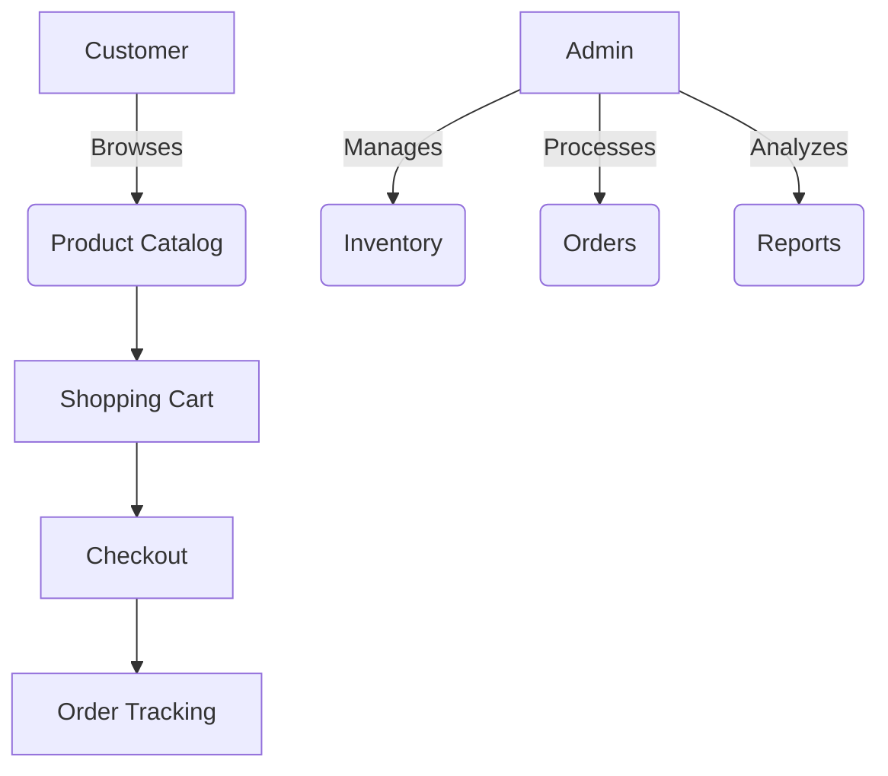
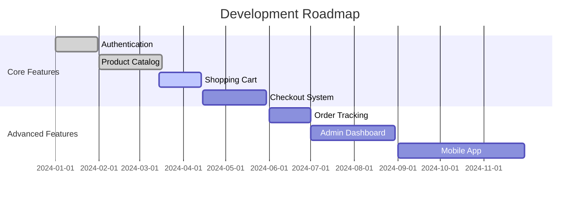

# Parts Bazar - Automotive Parts E-commerce Platform


## Overview

Parts Bazar is a cutting-edge e-commerce platform specializing in automotive parts and accessories. Built with modern web technologies, our platform offers an intuitive shopping experience for car enthusiasts, mechanics, and automotive businesses.



## Features

### 🛒 Shopping Experience

- **Product Catalog** with categories and filters
- **Advanced Search** with auto-suggestions
- **Wishlists** and saved items
- **Real-time Inventory** management

### 📦 Order Management

- **Multi-step Checkout** process
- **Order Tracking** with real-time updates
- **Digital Receipts** and invoices
- **Return Management** system

### 🛠️ Admin Capabilities

- **Dashboard** with sales analytics
- **Inventory Management** system
- **Customer Relationship** tools
- **Content Management** for promotions

### 📱 Technical Highlights

- **Responsive Design** for all devices
- **Progressive Web App** capabilities
- **JWT Authentication** with refresh tokens
- **Server-side Rendering** for SEO

## Technology Stack

**Frontend:**

- Next.js 14 (App Router)
- React 18
- Redux Toolkit
- Tailwind CSS
- Shadcn UI Components
- Framer Motion

**Backend:**

- Node.js
- Express.js
- MySQL
- Redis (for caching)

**Services:**

- Payment Processing (Bkash)
- Email Service (SendGrid)
- Cloud Storage (AWS S3)
- CI/CD (GitHub Actions)

## Getting Started

### Prerequisites

- Node.js v18+
- SQL Account
- Redis server

### Installation

1. Clone the repository:

   ```bash
   git clone https://github.com/Nasif28/partsbazar.git
   cd partsbazar
   ```

2. Install dependencies:

   ```bash
   npm install
   ```

3. Set up environment variables:

   ```bash
   cp .env.example .env.local
   ```

   Fill in your credentials in the `.env.local` file

4. Run the development server:

   ```bash
   npm run dev
   ```

5. Open [http://localhost:3000](http://localhost:3000) in your browser

## Project Structure

```
partsbazar/
├── public/                     # Static assets (images, etc.)
├── src/                        # Source files
│   ├── app/                    # App directory (Next.js routing)
│   │   ├── (frontend)/         # Dynamic route group
│   │   ├── admin/              # Admin pages
│   │   ├── user/               # User-specific pages
│   │   ├── client-layout.js    # Client-side layout
│   │   ├── layout.jsx          # Root layout file
│   │   ├── metadata.js         # SEO metadata
│   │   └── not-found.jsx       # Custom 404 page
│   ├── assets/                 # Static or reusable media assets
│   ├── components/             # Reusable React components
│   │   ├── About/
│   │   ├── Auth/
│   │   ├── Blogs/
│   │   ├── Brands/
│   │   ├── Contact/
│   │   ├── FAQ/
│   │   ├── Footer/
│   │   ├── Global/
│   │   ├── Header/
│   │   ├── Home/
│   │   ├── Products/
│   │   ├── SVG/
│   │   ├── UI/
│   │   ├── User/
│   │   ├── Videos/
│   │   └── ProtectedRoute.jsx  # Route protection wrapper
│   ├── data/                   # Static or mock data files
│   ├── lib/                    # Utility functions & helpers
│   ├── providers/              # Context and providers (e.g., theme, auth)
│   ├── redux/                  # Redux store and slices
│   └── styles/                 # Global & modular styles (CSS/SCSS)
├── .env                        # Environment variables
├── .gitignore                  # Git ignored files
├── components.json             # Custom component definitions (optional)
├── eslint.config.mjs           # ESLint flat config
├── jsconfig.json               # JS path aliases and IntelliSense
├── next.config.mjs             # Next.js configuration
├── package.json                # Project dependencies and scripts
├── package-lock.json           # Lock file for package versions
└── postcss.config.mjs          # PostCSS config (usually for Tailwind CSS)
```

## Configuration

### Environment Variables

| Variable Name           | Description               | Example Value       |
| ----------------------- | ------------------------- | ------------------- |
| `MONGODB_URI`           | MongoDB connection string | `mongodb+srv://...` |
| `JWT_SECRET`            | Secret for JWT tokens     | `supersecretkey123` |
| `STRIPE_SECRET_KEY`     | Stripe API secret key     | `sk_test_...`       |
| `SENDGRID_API_KEY`      | SendGrid API key          | `SG.abc123...`      |
| `AWS_ACCESS_KEY_ID`     | AWS access key for S3     | `AKIA...`           |
| `AWS_SECRET_ACCESS_KEY` | AWS secret access key     | `abc123...`         |
| `REDIS_URL`             | Redis connection URL      | `redis://...`       |

## Deployment

Parts Bazar is optimized for deployment on Render:

### Deployment Steps:

1. Push your code to a GitHub repository
2. Create a new project in Vercel
3. Connect your GitHub repository
4. Add environment variables
5. Deploy!

## Contributing

We welcome contributions! Please follow these steps:

1. Fork the repository
2. Create your feature branch (`git checkout -b feature/AmazingFeature`)
3. Commit your changes (`git commit -m 'Add some AmazingFeature'`)
4. Push to the branch (`git push origin feature/AmazingFeature`)
5. Open a Pull Request

## License

Distributed under the MIT License. See `LICENSE` for more information.

## Contact

**Project Maintainer:** [Parts Bazar]  
**Email:** [nasifzeehan1@gmail.com]  
**Website:** [https://nasifjihan.onrender.com](https://nasifjihan.onrender.com)

[](https://github.com/nasif28/partsbazar/issues)
[](https://github.com/nasif28/partsbazar/stargazers)
[](https://opensource.org/licenses/MIT)

## Roadmap



## Support

For support, please email support@partsbazar.com or join our [Discord server](https://discord.gg/partsbazar).
